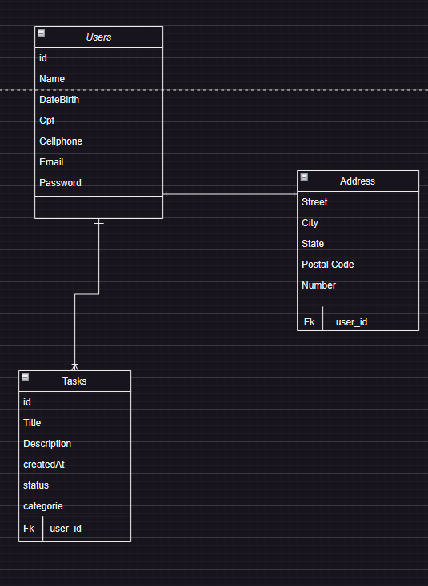

# Task Create

## Tabela de Conteúdos

- [Task Create](#task-create)
  - [Tabela de Conteúdos](#tabela-de-conteúdos)
  - [1. Visão Geral](#1-visão-geral)
  - [2. Diagrama ER](#2-diagrama-er)
  - [3. Início Rápido](#3-início-rápido)
    - [3.1 Intalando Dependências](#31-intalando-dependências)
    - [3.2 Variáveis de Ambiente](#32-variáveis-de-ambiente)
    - [3.3 Migrations](#33-migrations)
  - [4. Endpoints](#4-endpoints)
    - [Índice](#índice)
  - [1. **Users**](#1-users)
    - [Endpoints](#endpoints)
    - [1.1. **Criação de Usuário**](#11-criação-de-usuário)
    - [`/users`](#users)
    - [Exemplo de Request:](#exemplo-de-request)
    - [Corpo da Requisição:](#corpo-da-requisição)
    - [Exemplo de Response:](#exemplo-de-response)
    - [Possíveis Erros:](#possíveis-erros)
    - [1.2. **Listando Usuários**](#12-listando-usuários)
    - [`/users`](#users-1)
    - [Exemplo de Request:](#exemplo-de-request-1)
    - [Corpo da Requisição:](#corpo-da-requisição-1)
    - [Exemplo de Response:](#exemplo-de-response-1)
    - [Possíveis Erros:](#possíveis-erros-1)
    - [1.3. **Listar Usuário por ID**](#13-listar-usuário-por-id)
    - [`/users/:user_id`](#usersuser_id)
    - [Exemplo de Request:](#exemplo-de-request-2)
    - [Parâmetros da Requisição:](#parâmetros-da-requisição)
    - [Corpo da Requisição:](#corpo-da-requisição-2)
    - [Exemplo de Response:](#exemplo-de-response-2)
    - [Possíveis Erros:](#possíveis-erros-2)
    - [1.4. **Atualizar users**](#14-atualizar-users)
    - [`/users/:users_id`](#usersusers_id)
    - [Exemplo de Request:](#exemplo-de-request-3)
    - [Parâmetros da Requisição:](#parâmetros-da-requisição-1)
    - [Corpo da Requisição:](#corpo-da-requisição-3)
    - [Exemplo de Response:](#exemplo-de-response-3)
    - [Possíveis Erros:](#possíveis-erros-3)
    - [1.5. **Deletar users**](#15-deletar-users)
    - [`/users/:users_id`](#usersusers_id-1)
    - [Exemplo de Request:](#exemplo-de-request-4)
    - [Parâmetros da Requisição:](#parâmetros-da-requisição-2)
    - [Corpo da Requisição:](#corpo-da-requisição-4)
    - [Exemplo de Response:](#exemplo-de-response-4)
    - [Possíveis Erros:](#possíveis-erros-4)
  - [2. **Address**](#2-address)
    - [Endpoints](#endpoints-1)
    - [1.1. **Criação de Address**](#11-criação-de-address)
    - [`/adress`](#adress)
    - [Exemplo de Request:](#exemplo-de-request-5)
    - [Corpo da Requisição:](#corpo-da-requisição-5)
    - [Exemplo de Response:](#exemplo-de-response-5)
    - [Possíveis Erros:](#possíveis-erros-5)
    - [1.2. **Listando Addresss**](#12-listando-addresss)
    - [`/adress`](#adress-1)
    - [Exemplo de Request:](#exemplo-de-request-6)
    - [Corpo da Requisição:](#corpo-da-requisição-6)
    - [Exemplo de Response:](#exemplo-de-response-6)
    - [Possíveis Erros:](#possíveis-erros-6)
    - [1.3. **Listar Address por ID**](#13-listar-address-por-id)
    - [`/adress/:address_id`](#adressaddress_id)
    - [Exemplo de Request:](#exemplo-de-request-7)
    - [Parâmetros da Requisição:](#parâmetros-da-requisição-3)
    - [Corpo da Requisição:](#corpo-da-requisição-7)
    - [Exemplo de Response:](#exemplo-de-response-7)
    - [Possíveis Erros:](#possíveis-erros-7)
    - [1.4. **Atualizar adress**](#14-atualizar-adress)
    - [`/adress/:adress_id`](#adressadress_id)
    - [Exemplo de Request:](#exemplo-de-request-8)
    - [Parâmetros da Requisição:](#parâmetros-da-requisição-4)
    - [Corpo da Requisição:](#corpo-da-requisição-8)
    - [Exemplo de Response:](#exemplo-de-response-8)
    - [Possíveis Erros:](#possíveis-erros-8)
    - [1.5. **Deletar address**](#15-deletar-address)
    - [`/address/:address_id`](#addressaddress_id)
    - [Exemplo de Request:](#exemplo-de-request-9)
    - [Parâmetros da Requisição:](#parâmetros-da-requisição-5)
    - [Corpo da Requisição:](#corpo-da-requisição-9)
    - [Exemplo de Response:](#exemplo-de-response-9)
    - [Possíveis Erros:](#possíveis-erros-9)
  - [3. **Task**](#3-task)
    - [Endpoints](#endpoints-2)
    - [1.1. **Criação de tasks**](#11-criação-de-tasks)
    - [`/tasks`](#tasks)
    - [Exemplo de Request:](#exemplo-de-request-10)
    - [Corpo da Requisição:](#corpo-da-requisição-10)
    - [Nota:](#nota)
    - [Exemplo de Response:](#exemplo-de-response-10)
    - [Possíveis Erros:](#possíveis-erros-10)
    - [1.2. **Listando Tasks**](#12-listando-tasks)
    - [`/tasks`](#tasks-1)
    - [Exemplo de Request:](#exemplo-de-request-11)
    - [Corpo da Requisição:](#corpo-da-requisição-11)
    - [Exemplo de Response:](#exemplo-de-response-11)
    - [Possíveis Erros:](#possíveis-erros-11)
    - [1.3. **Listar Tasks por ID**](#13-listar-tasks-por-id)
    - [`/tasks/:tasks_id`](#taskstasks_id)
    - [Exemplo de Request:](#exemplo-de-request-12)
    - [Parâmetros da Requisição:](#parâmetros-da-requisição-6)
    - [Corpo da Requisição:](#corpo-da-requisição-12)
    - [Exemplo de Response:](#exemplo-de-response-12)
    - [Possíveis Erros:](#possíveis-erros-12)
    - [1.4. **Atualizar tasks**](#14-atualizar-tasks)
    - [`/tasks/:tasks_id`](#taskstasks_id-1)
    - [Exemplo de Request:](#exemplo-de-request-13)
    - [Parâmetros da Requisição:](#parâmetros-da-requisição-7)
    - [Corpo da Requisição:](#corpo-da-requisição-13)
    - [Exemplo de Response:](#exemplo-de-response-13)
    - [Possíveis Erros:](#possíveis-erros-13)
    - [1.5. **Deletar tasks**](#15-deletar-tasks)
    - [`/tasks/:tasks_id`](#taskstasks_id-2)
    - [Exemplo de Request:](#exemplo-de-request-14)
    - [Parâmetros da Requisição:](#parâmetros-da-requisição-8)
    - [Corpo da Requisição:](#corpo-da-requisição-14)
    - [Exemplo de Response:](#exemplo-de-response-14)
    - [Possíveis Erros:](#possíveis-erros-14)

---

## 1. Visão Geral

Visão geral do projeto, um pouco das tecnologias usadas.

- [NodeJS](https://nodejs.org/en/)
- [Express](https://expressjs.com/pt-br/)
- [TypeScript](https://www.typescriptlang.org/)
- [PostgreSQL](https://www.postgresql.org/)
- [Prisma](https://www.prisma.io)

A URL base da aplicação:
http://127.0.0.1:3333/

---

## 2. Diagrama ER
[ Voltar  para o topo ](#tabela-de-conteúdos)

Diagrama ER da API definindo bem as relações entre as tabelas do banco de dados.


---
## 3. Início Rápido
[ Voltar para o topo ](#tabela-de-conteúdos)

### 3.1 Intalando Dependências

instale dependências com o comando:

```shell
cd server
yarn
```

### 3.2 Variáveis de Ambiente
Em seguida, crie um arquivo **.env**, copiando o formato do arquivo **.env.example**:

```
cp .env.example .env
```

Configure suas variáveis de ambiente com suas credenciais do Postgres e uma nova database da sua escolha.

### 3.3 Migrations

Exxecute as migrations com o comando:

```
cd server
yarn prisma migrate dev
```

---

## 4. Endpoints

[ Voltar para o topo ](#tabela-de-conteúdos)

### Índice

- [Users](#1-users)
    - [POST - /users](#11-criação-de-usuário)
    - [GET - /users](#12-listando-usuários)
	- [GET - /users/:user_id](#13-listar-usuário-por-id)
- [Address](#2-address)
- [Task](#3-task)

---

## 1. **Users**
[ Voltar para os Endpoints ](#4-endpoints)

O objeto User é definido como:

| Campo      | Tipo   | Descrição                                     |
| -----------|--------|-------------------------------------------------|
| id         | string | Identificador único do usuário                  |
| name       | string | O nome do usuário.                              |
| email      | string | O e-mail do usuário.                            |
| password   | string | A senha de acesso do usuário                    |
| DateBirth  | string | Data de aniversário                             |
| cpf        | string | Cpf do usuário                                  |
| isAdm      | boolean| Define se um usuário é Administrador ou não.   |

### Endpoints

| Método   | Rota       | Descrição                               |
|----------|------------|-----------------------------------------|
| POST     | /users     | Criação de um usuário.                  |
| GET      | /users     | Lista todos os usuários.                 |
| GET      | /users/:user_id     | Lista um usuário usando seu ID como parâmetro.
| Patch    | /users/:user_id     | Atualiza o campo especificado no body da requisição do usuário, relacionado ao ID passado no parâmetro. 

---

### 1.1. **Criação de Usuário**

[ Voltar para os Endpoints ](#5-endpoints)

### `/users`

### Exemplo de Request:
```
POST /users
Host: http://suaapi.com/v1
Authorization: None
Content-type: application/json
```

### Corpo da Requisição:
```json
{
	"name":"nomeTeste", 
    "datebirth":"13052021",  
    "cpf":"00000000000",
	"email":"teste@gmail.com",  
    "password":"teste123"
}
```

### Exemplo de Response:
```
201 Created
```

```json
{
	"id": "cddef851-9ca0-4f4b-8052-46b69afb1711",
	"name":"nomeTeste", 
    "datebirth":"13052021",  
    "cpf":"00000000000",
}
```

### Possíveis Erros:
| Código do Erro | Descrição |
|----------------|-----------|
| 403 Conflict   | Email already registered. |

---

### 1.2. **Listando Usuários**

[ Voltar aos Endpoints ](#5-endpoints)

### `/users`

### Exemplo de Request:
```
GET /users
Host: http://suaapi.com/v1
Authorization: None
Content-type: application/json
```

### Corpo da Requisição:
```json
Vazio
```

### Exemplo de Response:
```
200 OK
```
```json
[
	{
	
		"id": "cddef851-9ca0-4f4b-8052-46b69afb1711",
	    "name":"nomeTeste", 
        "datebirth":"13052021", 
		"email": "teste@gmail.com",
		"isAdm": false,
		"created_at": "2023-05-09T17:04:57.708Z",
		"updated_at": "2023-05-09T17:04:57.708Z"
	
    }
]
```

### Possíveis Erros:
Nenhum, o máximo que pode acontecer é retornar uma lista vazia.

---

### 1.3. **Listar Usuário por ID**

[ Voltar aos Endpoints ](#5-endpoints)

### `/users/:user_id`

### Exemplo de Request:
```
GET /users/9cda28c9-e540-4b2c-bf0c-c90006d37893
Host: http://suaapi.com/v1
Authorization: None
Content-type: application/json
```

### Parâmetros da Requisição:
| Parâmetro   | Tipo        | Descrição                             |
|-------------|-------------|---------------------------------------|
| user_id     | string      | Identificador único do usuário (User) |

### Corpo da Requisição:
```json
Vazio
```

### Exemplo de Response:
```
200 OK
```
```json
{
	"id": "9cda28c9-e540-4b2c-bf0c-c90006d37893",
	"name": "Eduardo",
	"email": "edu@mail.com",
	"isAdm": true
}
```

Porem se o usuário já tiver uma task cadastrada com seu id um address
```json
{   
    "id": "9cda28c9-e540-4b2c-bf0c-c90006d37893",
	"name": "Eduardo",
	"email": "edu@mail.com",
	"datebirth": "25032001",
	"isAdm": false,
	"created_at": "2023-05-09T17:04:57.708Z",
	"updated_at": "2023-05-09T17:04:57.708Z",
	"tasks": [
		{
			"id": "59d4b7c0-f459-4808-80e1-f328b39f8918",
			"title": "loid",
			"description": "testdescription",
			"created_at": "2023-05-15T17:29:16.298Z",
			"updated_at": "2023-05-15T17:29:16.298Z",
			"status": true,
			"categorie": "health",
			"user_id": "9cda28c9-e540-4b2c-bf0c-c90006d37893"
		}
	],
	"address": {
		"id": "eddd9e69-dc94-4661-9e14-530ee8080e03",
		"street": "testeStreet",
		"city": "testeCity",
		"state": "go",
		"postalCode": "00000001",
		"number": 22,
		"user_id": "9cda28c9-e540-4b2c-bf0c-c90006d37893"
	}
}
```

### Possíveis Erros:
| Código do Erro | Descrição |
|----------------|-----------|
| 403 Not Found   | user not exists |

### 1.4. **Atualizar users**

[ Voltar aos Endpoints ](#4-endpoints)

### `/users/:users_id`

### Exemplo de Request:
```
Patch /users/9cda28c9-e540-4b2c-bf0c-c90006d37893
Host: http://suaapi.com/v1
Authorization: Token
Content-type: application/json
```

### Parâmetros da Requisição:
| Parâmetro   | Tipo        | Descrição                             |
|-------------|-------------|---------------------------------------|
| users_id     | string      | Identificador único do users (users) |

### Corpo da Requisição:
```json
    {
	"name": "gabriel Oliveira barbosa"   
    }
```

### Exemplo de Response:
```
200 OK
```
```json
{
	"message": "user Updated"
}
```


### Possíveis Erros:
| Código do Erro | Descrição |
|----------------|-----------|
| 400 Not Found   | task not exists      |
| 400 Not Found   | categorie not exists |

---

### 1.5. **Deletar users**

[ Voltar aos Endpoints ](#4-endpoints)

### `/users/:users_id`

### Exemplo de Request:
```
Delete /users/9cda28c9-e540-4b2c-bf0c-c90006d37893
Host: http://suaapi.com/v1
Authorization: Token
Content-type: application/json
```

### Parâmetros da Requisição:
| Parâmetro   | Tipo        | Descrição                             |
|-------------|-------------|---------------------------------------|
| users_id     | string      | Identificador único do users (users) |

### Corpo da Requisição:
```json
   
```

### Exemplo de Response:
```
204 OK
```
```json

```


### Possíveis Erros:
| Código do Erro | Descrição |
|----------------|-----------|
| 400 Not Found   | user not exists      |

---

## 2. **Address**
[ Voltar para os Endpoints ](#4-endpoints)

O objeto Adress é definido como:

| Campo      | Tipo   | Descrição                                     |
| -----------|--------|-------------------------------------------------|
| id         | string | Identificador único do endereço|
| street     | string | A rua  do endereço             |
| city       | string | A cidade do Endereço           |
| state      | string | O Estado do endereço           |
| PostalCode | string | O CEP do endereço              |
| number     | Integer| O numero do endereço           |

### Endpoints

| Método   | Rota       | Descrição                               |
|----------|------------|-----------------------------------------|
| POST     | /address     | Criação de um endereço.                  |
| GET      | /address     | Lista todos os endereços.                 |
| GET      | /address/:user_id     | Lista um endereço usando seu ID como parâmetro.
| Patch    | /address/:user_id     | Atualiza o campo especificado no body da requisição do endereço, relacionado ao ID passado no parâmetro. 

---

### 1.1. **Criação de Address**

[ Voltar para os Endpoints ](#5-endpoints)

### `/adress`

### Exemplo de Request:
```
POST /adress
Host: http://suaapi.com/v1
Authorization: Token
Content-type: application/json
```

### Corpo da Requisição:
```json
{
  "street":"testeStreet", 
  "city":"testeCity",  
  "state":"go",        
  "postalCode":"00000002",  
  "number":23
}
```

### Exemplo de Response:
```
201 Created
```

```json
{
	"id": "cddef851-9ca0-4f4b-8052-46b69afb1711",
	"street":"testeStreet", 
    "city":"testeCity",  
    "state":"go",        
}
```

### Possíveis Erros:
| Código do Erro | Descrição |
|----------------|-----------|
| 400 Bad Request   | address already exists |

---

### 1.2. **Listando Addresss**

[ Voltar aos Endpoints ](#5-endpoints)

### `/adress`

### Exemplo de Request:
```
GET /adress
Host: http://suaapi.com/v1
Authorization: Token
Content-type: application/json
```

### Corpo da Requisição:
```json
Vazio
```

### Exemplo de Response:
```
200 OK
```
```json
[
	
	{
		"id": "5ed782cb-edb2-4ae4-9c1b-675c071b421c",
		"street": "testeStreet",
		"city": "testeCity",
		"state": "go",
		"postalCode": "00000000",
		"number": 21,
		"user_id": "031d28d4-718f-4c84-a6a3-fd0adfcb5627",
		"user": {
			"name":"nomeTeste",  
		    "email": "teste@gmail.com",
	    }
    }
]
```

### Possíveis Erros:
Nenhum, o máximo que pode acontecer é retornar uma lista vazia.

---

### 1.3. **Listar Address por ID**

[ Voltar aos Endpoints ](#4-endpoints)

### `/adress/:address_id`

### Exemplo de Request:
```
GET /adress/9cda28c9-e540-4b2c-bf0c-c90006d37893
Host: http://suaapi.com/v1
Authorization: Token
Content-type: application/json
```

### Parâmetros da Requisição:
| Parâmetro   | Tipo        | Descrição                             |
|-------------|-------------|---------------------------------------|
| address_id     | string      | Identificador único do Address (Address) |

### Corpo da Requisição:
```json
Vazio
```

### Exemplo de Response:
```
200 OK
```
```json
{
	"id": "5ed782cb-edb2-4ae4-9c1b-675c071b421c",
	"street": "testeStreet",
	"city": "testeCity",
	"state": "go",
	"postalCode": "00000000",
	"number": 21,
	"user_id": "031d28d4-718f-4c84-a6a3-fd0adfcb5627"
}
```


### Possíveis Erros:
| Código do Erro | Descrição |
|----------------|-----------|
| 403 Not Found   | Address not exists |

### 1.4. **Atualizar adress**

[ Voltar aos Endpoints ](#4-endpoints)

### `/adress/:adress_id`

### Exemplo de Request:
```
Patch /adress/9cda28c9-e540-4b2c-bf0c-c90006d37893
Host: http://suaapi.com/v1
Authorization: Token
Content-type: application/json
```

### Parâmetros da Requisição:
| Parâmetro   | Tipo        | Descrição                             |
|-------------|-------------|---------------------------------------|
| adress_id     | string      | Identificador único do adress (adress) |

### Corpo da Requisição:
```json
    {
        "number": 26
    }
```

### Exemplo de Response:
```
200 OK
```
```json
{
	"id": "5ed782cb-edb2-4ae4-9c1b-675c071b421c",
	"street": "testeStreet",
	"city": "testeCity",
	"state": "go",
	"postalCode": "00000000",
	"number": 26,
	"user_id": "031d28d4-718f-4c84-a6a3-fd0adfcb5627"
}
```


### Possíveis Erros:
| Código do Erro | Descrição |
|----------------|-----------|
| 400 Not Found   | task not exists      |
| 400 Not Found   | categorie not exists |

---

### 1.5. **Deletar address**

[ Voltar aos Endpoints ](#4-endpoints)

### `/address/:address_id`

### Exemplo de Request:
```
Delete /address/9cda28c9-e540-4b2c-bf0c-c90006d37893
Host: http://suaapi.com/v1
Authorization: Token
Content-type: application/json
```

### Parâmetros da Requisição:
| Parâmetro   | Tipo        | Descrição                             |
|-------------|-------------|---------------------------------------|
| address_id     | string      | Identificador único do address (address) |

### Corpo da Requisição:
```json
   
```

### Exemplo de Response:
```
204 OK
```
```json

```


### Possíveis Erros:
| Código do Erro | Descrição |
|----------------|-----------|
| 400 Not Found   | address not exists      |

---

## 3. **Task**
[ Voltar para os Endpoints ](#4-endpoints)

O objeto Task é definido como:

| Campo      | Tipo   | Descrição                                     |
| -----------|--------|-------------------------------------------------|
| id         | string | Identificador único do tarefa|
| title      | string | O titulo da tarefa             |
| description| string | A descrição da tarefa          |
| status     | boolean | O status da tarefa, usado para ver se a tarefa já foi realizada ou não.|
| categorie  | string | A categoria da terefa, pode se health, exercise ou work|


### Endpoints

| Método   | Rota       | Descrição                               |
|----------|------------|-----------------------------------------|
| POST     | /tasks     | Criação de um tarefas/tasks.                  |
| GET      | /tasks     | Lista todos os tarefas/tasks.                 |
| GET      | /tasks/:user_id     | Lista um tarefas/tasks usando seu ID como parâmetro.
| Patch    | /tasks/:user_id     | Atualiza o campo especificado no body da requisição do tarefas/tasks, relacionado ao ID passado no parâmetro. 

---

### 1.1. **Criação de tasks**

[ Voltar para os Endpoints ](#5-endpoints)

### `/tasks`

### Exemplo de Request:
```
POST /tasks
Host: http://suaapi.com/v1
Authorization: Token
Content-type: application/json
```

### Corpo da Requisição:
```json
{
   "title": "teste6",
   "description": "test6",
   "categorie": "health"
}
```
### Nota:
categorie pode ser apenas três opções de escolha, health, work ou exercise.

### Exemplo de Response:
```
201 Created
```

```json
{
	"id": "fa8a2554-1734-4e50-8c05-4c2590fd57e6",
	"title": "teste6",
	"description": "test6",
	"created_at": "2023-05-16T18:37:31.850Z",
	"updated_at": "2023-05-16T18:37:31.850Z",
	"status": true,
	"categorie": "health",
	"user_id": "030aabd8-1a0a-4966-a9ab-804652fedfc4"     
}
```

### Possíveis Erros:
| Código do Erro | Descrição |
|----------------|-----------|
| 400 Bad Request   | task already exist |
| 400 Bad Request   | user not exists |
| 400 Bad Request   | categorie invalid|


---

### 1.2. **Listando Tasks**

[ Voltar aos Endpoints ](#4-endpoints)

### `/tasks`

### Exemplo de Request:
```
GET /tasks
Host: http://suaapi.com/v1
Authorization: Token
Content-type: application/json
```

### Corpo da Requisição:
```json
Vazio
```

### Exemplo de Response:
```
200 OK
```
```json
[
	
	{
		"id": "76d4b7d6-bf36-4fe1-ae58-b3b7f4f2f171",
		"title": "teste3",
		"description": "test3",
		"categorie": "health",
		"status": true,
		"created_at": "2023-05-16T18:25:57.633Z",
		"user": {
			"id": "cddef851-9ca0-4f4b-8052-46b69afb1711",
            "name":"nomeTeste", 
            "cpf":"00000000000", 
            "email": "teste@gmail.com",
		}
    }
]
```

### Possíveis Erros:
Nenhum, o máximo que pode acontecer é retornar uma lista vazia.

---

### 1.3. **Listar Tasks por ID**

[ Voltar aos Endpoints ](#4-endpoints)

### `/tasks/:tasks_id`

### Exemplo de Request:
```
GET /tasks/9cda28c9-e540-4b2c-bf0c-c90006d37893
Host: http://suaapi.com/v1
Authorization: Token
Content-type: application/json
```

### Parâmetros da Requisição:
| Parâmetro   | Tipo        | Descrição                             |
|-------------|-------------|---------------------------------------|
| tasks_id     | string      | Identificador único do tasks (tasks) |

### Corpo da Requisição:
```json
Vazio
```

### Exemplo de Response:
```
200 OK
```
```json
{
		"id": "76d4b7d6-bf36-4fe1-ae58-b3b7f4f2f171",
		"title": "teste3",
		"description": "test3",
		"categorie": "health",
		"status": true,
		"created_at": "2023-05-16T18:25:57.633Z",
		"user": {
			"id": "cddef851-9ca0-4f4b-8052-46b69afb1711",
            "name":"nomeTeste", 
            "cpf":"00000000000", 
            "email": "teste@gmail.com",
		}
    }
```


### Possíveis Erros:
| Código do Erro | Descrição |
|----------------|-----------|
| 400 Not Found   | task not exists |

### 1.4. **Atualizar tasks**

[ Voltar aos Endpoints ](#4-endpoints)

### `/tasks/:tasks_id`

### Exemplo de Request:
```
Patch /tasks/9cda28c9-e540-4b2c-bf0c-c90006d37893
Host: http://suaapi.com/v1
Authorization: Token
Content-type: application/json
```

### Parâmetros da Requisição:
| Parâmetro   | Tipo        | Descrição                             |
|-------------|-------------|---------------------------------------|
| tasks_id     | string      | Identificador único do tasks (tasks) |

### Corpo da Requisição:
```json
    {
        "title": "teste7",
    }
```

### Exemplo de Response:
```
200 OK
```
```json
{
		"id": "76d4b7d6-bf36-4fe1-ae58-b3b7f4f2f171",
		"title": "teste7",
		"description": "test3",
		"categorie": "health",
		"status": true,
		"created_at": "2023-05-16T18:25:57.633Z",
		"user": {
			"id": "cddef851-9ca0-4f4b-8052-46b69afb1711",
            "name":"nomeTeste", 
            "cpf":"00000000000", 
            "email": "teste@gmail.com",
		}
    }
```


### Possíveis Erros:
| Código do Erro | Descrição |
|----------------|-----------|
| 400 Not Found   | task not exists      |
| 400 Not Found   | categorie not exists |

---

### 1.5. **Deletar tasks**

[ Voltar aos Endpoints ](#4-endpoints)

### `/tasks/:tasks_id`

### Exemplo de Request:
```
Delete /tasks/9cda28c9-e540-4b2c-bf0c-c90006d37893
Host: http://suaapi.com/v1
Authorization: Token
Content-type: application/json
```

### Parâmetros da Requisição:
| Parâmetro   | Tipo        | Descrição                             |
|-------------|-------------|---------------------------------------|
| tasks_id     | string      | Identificador único do tasks (tasks) |

### Corpo da Requisição:
```json
   
```

### Exemplo de Response:
```
204 OK
```
```json

```


### Possíveis Erros:
| Código do Erro | Descrição |
|----------------|-----------|
| 400 Not Found   | task not exists      |


